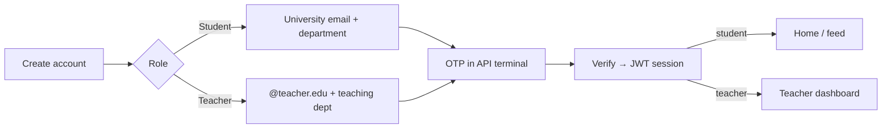
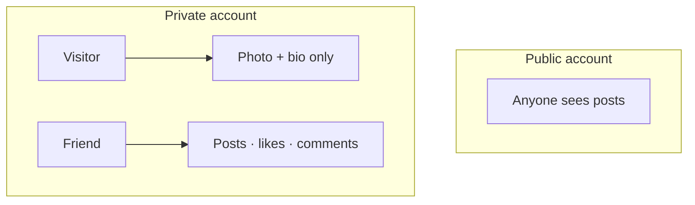
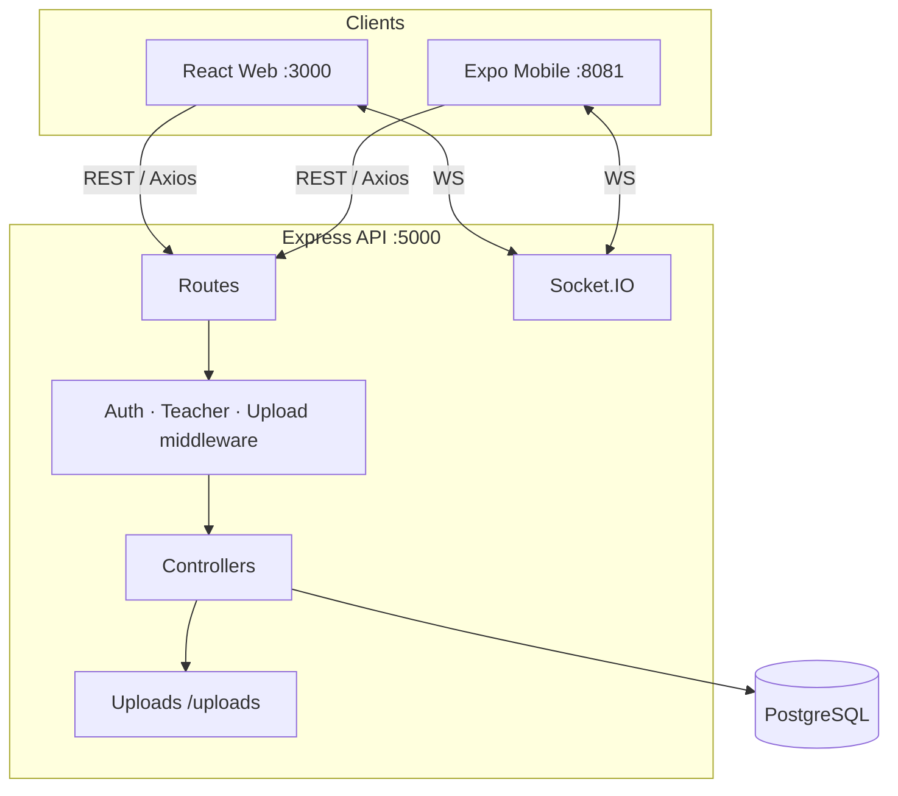
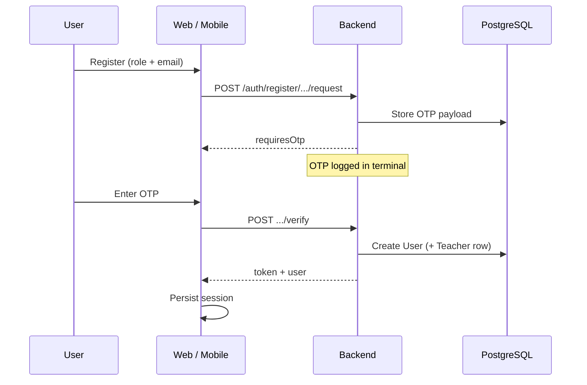
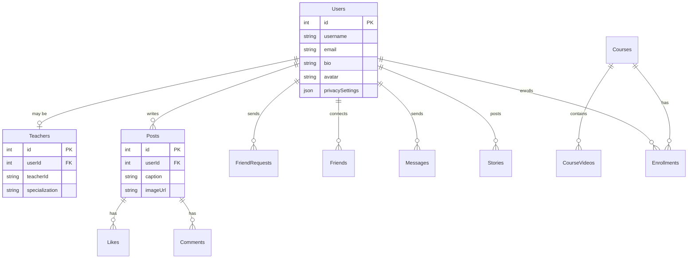

<div align="center">

# Campus Hub

### Learn. Connect. Grow — one campus platform.

**E-learning · Social networking · Real-time messaging · Teacher tools**

[](https://nodejs.org/)
[](https://reactjs.org/)
[](https://expo.dev/)
[](https://www.postgresql.org/)
[](https://expressjs.com/)
[](LICENSE)

**[Quick start](#-quick-start)** · **[Features](#-features)** · **[Architecture](#-architecture)** · **[Apps](#-apps)** · **[API](#-api-overview)** · **[Changelog](#-recent-updates)**

</div>

---

## Overview

**Campus Hub** is a full-stack university platform that unifies **courses**, **social media**, and **messaging** for students and teachers — available on **web** and **mobile (Expo)**.

| Layer | Stack | Port |
|-------|--------|------|
| API | Node.js · Express · Sequelize · Socket.IO | `5000` |
| Web | React 18 · Ant Design · Axios | `3000` |
| Mobile | Expo SDK 54 · Expo Router · React Native | `8081` (Expo Go) |
| Database | PostgreSQL | — |

```text
┌──────────────────────────────────────────────────────────────────┐
│                         CAMPUS HUB                               │
├────────────────────┬────────────────────┬────────────────────────┤
│   E-Learning       │   Social           │   Real-time            │
│   Courses · videos │   Posts · stories  │   Chat · notifications │
│   Progress · grades│   Friends · bios   │   Socket.IO            │
└────────────────────┴────────────────────┴────────────────────────┘
         ▲                      ▲                      ▲
         │                      │                      │
    Web :3000            Mobile Expo Go           API :5000
```

---

## Quick start

### Clone

```powershell
git clone https://github.com/abel2800/Campus-Hub.git
cd Campus-Hub
npm run install:all
```

### Backend env

```powershell
cd backend
copy .env.example .env
# edit .env — set JWT_SECRET and DB_PASSWORD

copy config\config.example.json config\config.json
# optional if you prefer JSON over .env for Sequelize CLI
```

Or rely only on `backend/.env` (`DB_*` variables). **Never commit** `.env` or `config.json` with real passwords.

That starts **API + web + Expo** together:

| Service | URL |
|---------|-----|
| API | http://localhost:5000 |
| Web | http://localhost:3000 |
| Mobile | Scan Expo QR · `exp://YOUR_LAN_IP:8081` |

```powershell
npm stop          # free ports 3000 / 5000 / 8081
npm run start:tunnel   # Expo tunnel if Wi‑Fi fails
```

### First-time database

1. Create a PostgreSQL database (e.g. `campushub`).
2. Configure `backend/.env` (or `backend/config/config.json`) with your DB credentials and `JWT_SECRET`.
3. Start the API — models sync on boot (`sequelize.sync`).

OTP codes (registration / password reset) print in the **API terminal**:

```text
[OTP] purpose=register email=… code=123456
```

---

## Features

### Auth & roles

- Unified **Student / Teacher** registration with **OTP verification**
- Teachers must use a **`@teacher.edu`** email
- Login with **email or username**
- JWT sessions · forgot / reset password



### Social (Instagram-style)

| Feature | Details |
|---------|---------|
| **Feed** | Mutual friends’ posts + your own |
| **Posts** | Text / images · like · comment |
| **Stories** | 24h media · view · like |
| **Friends** | Search · request · accept · mutual graph |
| **Profiles** | Bio · avatar · IG-style post grid |
| **Privacy** | Public / private accounts |
| **Friend list** | Show or hide on profile |



### E-learning

- Course catalog · enroll · watch videos
- Progress tracking · grades
- Teacher: create / edit courses · upload videos · analytics

### Messaging

- Recent chats · 1:1 threads
- Search users from chat
- Messaging restricted to **friends**

---

## Architecture



### Auth & social flow



---

## Apps

### Repository layout

```text
campushub/
├── backend/          # Express API, Sequelize, Socket.IO
├── frontend/         # React web (CRA + Ant Design)
├── mobile-expo/      # Primary mobile app (Expo Go)
├── mobile/           # Legacy Flutter client (optional)
├── scripts/          # npm start / stop orchestration
├── package.json      # install:all · start · stop
└── README.md
```

### Web (`frontend/`)

- Landing · login · unified create-account
- Student home · courses · social · friends · chat · profile · settings
- Teacher portal (`/teacher`) · course CRUD · videos · analytics
- Instagram-style **profile post grid** with like / comment modal

### Mobile (`mobile-expo/`)

- Expo Router tabs: **Home · Feed · Friends · Messages · Profile**
- Auth: login · register (student/teacher) · OTP · forgot password
- Social feed · stories · edit profile · avatars
- Privacy toggles in Settings
- Campus 2090 dark glass UI theme

### API (`backend/`)

| Area | Prefix |
|------|--------|
| Auth | `/api/auth` |
| Users / privacy / avatar | `/api/users` |
| Friends | `/api/friends` |
| Posts | `/api/posts` |
| Stories | `/api/stories` |
| Messages | `/api/messages` |
| Courses | `/api/courses` |
| Teachers | `/api/teachers` |
| Notifications | `/api/notifications` |

---

## API overview

### Auth

| Method | Endpoint | Notes |
|--------|----------|-------|
| `POST` | `/api/auth/register/request` | Student OTP |
| `POST` | `/api/auth/register/verify` | Student verify |
| `POST` | `/api/auth/register/teacher/request` | Teacher OTP (`@teacher.edu`) |
| `POST` | `/api/auth/register/teacher/verify` | Teacher verify |
| `POST` | `/api/auth/login` | Email **or** username |
| `GET` | `/api/auth/me` | Current user |
| `POST` | `/api/auth/forgot-password` | Reset OTP |
| `POST` | `/api/auth/reset-password` | Apply new password |

### Social & friends

| Method | Endpoint | Notes |
|--------|----------|-------|
| `GET` | `/api/posts/feed` | Mutual friends + self |
| `POST` | `/api/posts/:id/like` | Toggle like |
| `POST` | `/api/posts/:id/comment` | Add comment |
| `GET` | `/api/posts/user/:userId` | Privacy-gated |
| `GET` | `/api/friends/list` | Mutual friends |
| `POST` | `/api/friends/request` | `{ receiverId }` |
| `POST` | `/api/friends/requests/:id/accept` | Accept |
| `GET` | `/api/friends/search/users?query=` | Search + status |
| `PUT` | `/api/users/privacy` | Private account · friend list |

### Privacy rules

| Setting | Effect |
|---------|--------|
| **Public** | Others can see posts (if friends list allowed) |
| **Private** | Strangers see **avatar + bio only** |
| **Show friends list** | Toggle whether others can see your friends |

---

## Database schema (core)



---

## Environment

### Backend (`backend/.env`)

```env
PORT=5000
JWT_SECRET=your-strong-secret
DB_HOST=localhost
DB_PORT=5432
DB_NAME=campushub
DB_USER=postgres
DB_PASSWORD=your-password
```

### Mobile

Lan IP is resolved automatically for Expo Go. Override if needed:

```env
EXPO_PUBLIC_API_HOST=192.168.x.x
```

---

## Scripts

| Command | Description |
|---------|-------------|
| `npm run install:all` | Install root + backend + frontend + mobile-expo |
| `npm start` | Start API, web, and Expo together |
| `npm stop` | Free ports `3000`, `5000`, `8081` |
| `npm run backend` | API only |
| `npm run frontend` | Web only |
| `npm run mobile` | Expo LAN only |
| `npm run start:tunnel` | Expo tunnel mode |

Backend extras:

```powershell
cd backend
npm test
npm run reset-db
```

---

## Recent updates

Summary of the latest platform polish (web + mobile + API):

### Auth
- Unified registration with **Student / Teacher** role selector
- Teacher emails restricted to **`@teacher.edu`**
- OTP verification for both roles
- Login accepts **email or username**
- Mobile login UI centered, keyboard-aware (no “2090” promo chip)

### Social & profiles
- Mutual friendship graph on accept (two-way rows)
- Friends tab in the **mobile navbar**
- Visit any profile before friending (bio + posts when public)
- Instagram-style **private accounts**
- **Show / hide friends list** privacy setting
- Web profiles use an **IG-style post grid** with like & comment
- Mobile feed: likes, comments, story viewer + like
- Profile avatars display correctly after upload

### Messaging
- Friends-only messaging
- User search on the chat screen
- Friend accept fixed for reliability

### Quality
- Repo cleanup: removed dead stubs, unused routers, dual yarn locks, Expo boilerplate
- Kept active apps: `backend`, `frontend`, `mobile-expo` (+ optional Flutter `mobile/`)

---

## Troubleshooting

| Issue | Fix |
|-------|-----|
| Web proxy / `ECONNREFUSED :5000` | API crashed or not running — check `[API]` logs, restart `npm start` |
| Mobile can’t reach API | Same Wi‑Fi · allow Local Network · or `npm run start:tunnel` |
| Android USB | `adb reverse tcp:8081 tcp:8081` and `adb reverse tcp:5000 tcp:5000` → `exp://127.0.0.1:8081` |
| OTP missing | Watch the API terminal for `[OTP] … code=` |
| Teacher blocked from dashboard | Finish teacher OTP registration so a `Teachers` row exists |

---

## Contributing

1. Fork / branch from `main`
2. Keep API, web, and mobile behavior aligned when touching shared flows
3. Prefer real API data over mocks
4. Open a PR with a short summary and test notes

---

## License

MIT © Campus Hub contributors

---

<div align="center">

**Campus Hub** — one platform for courses, friends, and campus life.

</div>
